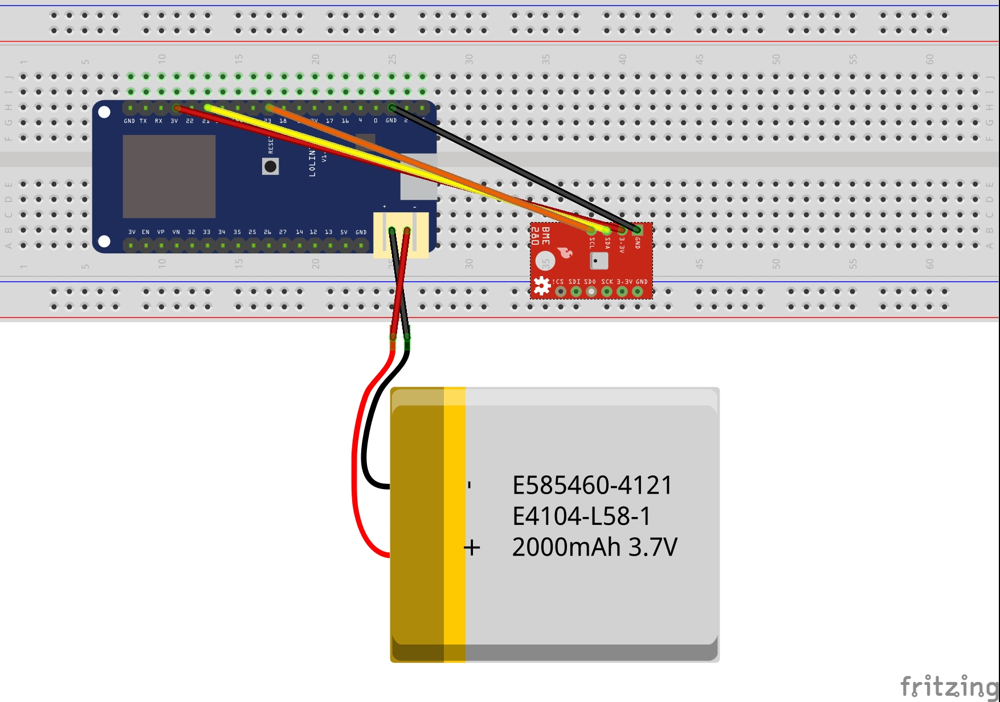

# lolin32_mqtt_bme280

WEMOS Lolin32 (*Lite*) serving BME280 temperature and humidity data via MQTT

## Layout



## Usage
In order to use the code, rename the WLAN and MQTT header files and fill in your configuration.

```shell
$ mv wlan.h.example wlan.h
$ mv mqtt.h.example mqtt.h
```

## Note on WEMOS Lolin32 / generic ESP32

The Lolin32 Lite needs two additional lines of code in order to find the BME280 sensor:

```c
/* THIS IS NEEDED FOR Lolin32 Lite ONLY */
/* for normal ESP32 boards, use pins 21 + 22 */
#define I2C_SDA_PIN 23
#define I2C_SCL_PIN 22
```

For conventional Lolin32 or generic ESP32 boards, remove those two lines and connect to the appropriate I²C pins (*e.g. 21 and 22*).
